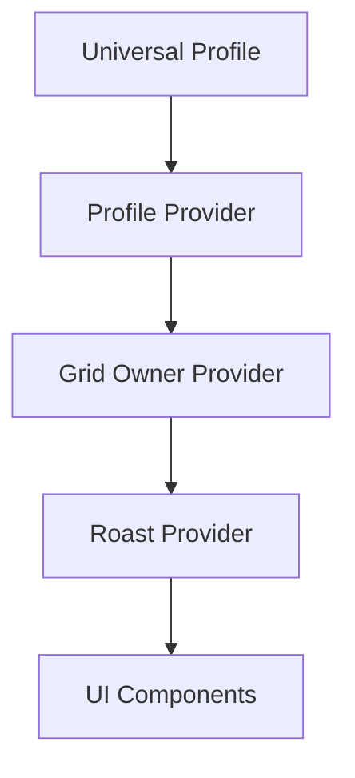

# 🔥 Roasted

Ever wanted to immortalize your best burns on the blockchain? Now you can! Roasted is a Web3 app that lets you turn savage roasts into NFTs on LUKSO.

## What is this?

Roasted is a fun little app where you can:
- Roast other people's Universal Profiles and mint those roasts as NFTs
- Get roasted and earn money when people roast you (if you're brave enough)
- Use AI to generate witty roasts based on someone's Twitter/X profile
- Tip roasts you find particularly spicy 🌶️

## How it works

1. Connect your LUKSO Universal Profile
2. Link your Twitter/X account to enable roasting
3. Set your "roast price" - how much others need to pay to roast you
4. Start roasting or get roasted!

Each roast gets minted as an NFT, and the roastee (person getting roasted) earns the roast price. If someone really likes a roast, they can tip extra LYX to show appreciation.

## Features

- 🤖 AI-powered roast generation
- 💰 Earn LYX from getting roasted
- 🔥 Feed of spicy roasts
- 🎭 Custom or AI-generated roasts
- 💸 Tipping system for extra-spicy burns
- 🐦 Twitter/X integration for context
- ⚡ Built on LUKSO for fast, cheap transactions & dynamic NFTs!

## Tech Stack

- Next.js
- LUKSO Universal Profiles
- LPS 8
- Tailwind CSS
- Framer Motion
- GraphQL
- IPFS (via Pinata)

# Technical Deep Dive

## Smart Contract Architecture

Our core contract `Roasted.sol` implements LSP8 (NFT standard on LUKSO) with custom functionality for roasting mechanics:

- **Tokenomics**: Each roast is minted as a unique NFT with metadata containing both the roast content and roastee information
- **Price Management**: Users can set their own roast price through `setRoastPrice()`, determining how much LYX someone needs to pay to roast them
- **Tipping System**: Implements a direct tipping mechanism via `tipRoast()` where 100% of tips go to the roastee
- **Withdrawal Logic**: Roastees can withdraw their earned LYX through `withdraw()` function

## Universal Profile Integration

We leverage LUKSO's Universal Profile for:
- Onchain social features
- LSP8 token interactions

## Frontend Architecture

### Data Flow


### Key Components

1. **Profile Management**
   - Custom hooks for UP data fetching
   - Twitter/X account linking via OAuth
   - Profile state management through Context API

2. **Roasting System**
   - Infinite scroll implementation using `react-intersection-observer`
   - Real-time state management for roast transactions
   - Optimistic UI updates for better UX

3. **AI Integration**
   - Custom API endpoint for roast generation
   - Context-aware prompts using Twitter/X data

### IPFS Integration

We use Pinata for decentralized storage:
- NFT metadata storage
- Roast content persistence

### GraphQL Implementation

Custom queries for efficient data fetching:
```graphql
query GetProfiles($addresses: [String!]!) {
  Profile(where: { id: { _in: $addresses }}) {
    id
    name
    # Additional profile fields
  }
}
```

### State Management

We implement a multi-provider architecture:
- `GridOwnerProvider`: Manages ownership and earnings
- `ProfileProvider`: Handles UP and social data
- `RoastProvider`: Controls roasting mechanics

## Future Improvements

1. **Scalability**
   - Implement subgraphs for better query performance
   - Add caching layer for frequently accessed data
   - Optimize batch operations

2. **Features**
   - Advanced roast analytics
   - Community governance
   - Roast competitions

3. **Social Features**
   - Following system implementation (LSP26)
   - Leaderboards

## Development Setup

```bash
# Install dependencies
npm install

# Set up environment variables
cp .env.example .env.local

# Start development server
npm run dev
```

Required environment variables:

NEXT_PUBLIC_LUKSO_RPC=
NEXT_PUBLIC_PINATA_API_KEY=
NEXT_PUBLIC_PINATA_SECRET_KEY=
TWITTER_CLIENT_ID=
TWITTER_CLIENT_SECRET=

---
Built for Hack the Grid Level 2 on LUKSO | [Live Demo](https://roasted.xyz)
